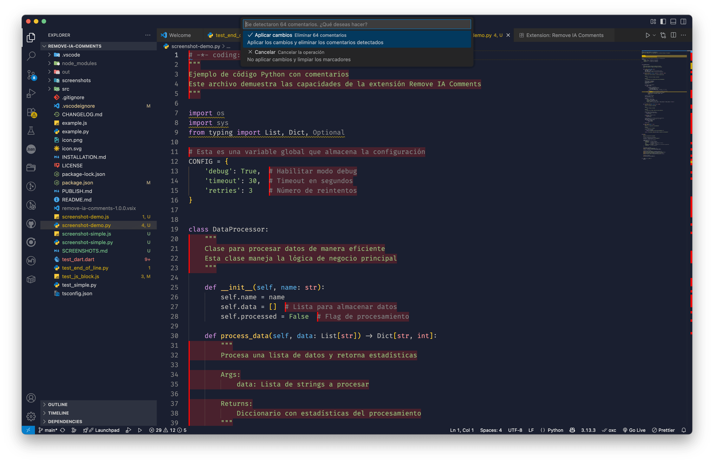

# Remove IA Comments

Una extensión de VSCode que elimina comentarios del archivo actual con funcionalidad de preview avanzada y eliminación directa, similar a como funciona la IA en Cursor.

## 📸 Vista Previa



_Código con comentarios marcados en rojo - Preview visual de la extensión_

## ✨ Características Principales

- 🎯 **Dos modos de operación**: Preview visual y eliminación directa
- 🔍 **Detección inteligente** para Python, JavaScript, TypeScript y Dart
- 🎨 **Preview visual** con marcadores rojos en comentarios detectados
- 🖱️ **Menú contextual nativo** para aplicar o cancelar cambios
- 💾 **Guardado automático** después de aplicar cambios
- 🧹 **Limpieza automática** al guardar el archivo
- 🛡️ **Preservación inteligente** de docstrings y JSDoc importantes
- 🔧 **Arquitectura extensible** para agregar nuevos lenguajes
- 🎪 **Interfaz nativa** que respeta el tema de VSCode

## 🚀 Modos de Operación

### 🔍 Modo Preview (Recomendado)

- **Atajo**: `Ctrl+Shift+R` (Windows/Linux) o `Cmd+Shift+R` (Mac)
- **Funcionalidad**: Resalta comentarios en rojo y muestra menú contextual
- **Ideal para**: Revisar cambios antes de aplicar

### ⚡ Modo Directo

- **Atajo**: `Ctrl+Shift+D` (Windows/Linux) o `Cmd+Shift+D` (Mac)
- **Funcionalidad**: Elimina comentarios directamente sin preview
- **Ideal para**: Usuarios experimentados que quieren eliminación rápida

## 🌐 Lenguajes Soportados

### Python

- **Comentarios de línea**: `# comentario`
- **Comentarios de bloque**: `"""comentario multilínea"""` y `'''comentario multilínea'''`
- **Comentarios al final de línea**: `código # comentario`
- **Preserva**: Docstrings de funciones y clases

### JavaScript

- **Comentarios de línea**: `// comentario`
- **Comentarios de bloque**: `/* comentario */`
- **Comentarios al final de línea**: `código // comentario`
- **Preserva**: Comentarios JSDoc (`/** ... */`)

### TypeScript

- **Comentarios de línea**: `// comentario`
- **Comentarios de bloque**: `/* comentario */`
- **Comentarios al final de línea**: `código // comentario`
- **Preserva**: Comentarios JSDoc (`/** ... */`)

### Dart

- **Comentarios de línea**: `// comentario`
- **Comentarios de bloque**: `/* comentario */`
- **Comentarios al final de línea**: `código // comentario`
- **Preserva**: Comentarios de documentación (`/// ...` y `/** ... */`)
- **Preserva**: Definiciones de clases, mixins, enums, extensiones y typedefs

## 📦 Instalación

### Desarrollo

1. **Clona el repositorio**:

   ```bash
   git clone <repository-url>
   cd remove-ia-comments
   ```

2. **Instala dependencias**:

   ```bash
   npm install
   ```

3. **Compila la extensión**:

   ```bash
   npm run compile
   ```

4. **Ejecuta en modo desarrollo**:
   - Presiona `F5` en VSCode
   - Se abrirá una nueva ventana de VSCode con la extensión cargada

### Uso en Producción

1. **Empaqueta la extensión**:

   ```bash
   npm run vscode:prepublish
   ```

2. **Instala desde archivo .vsix**:
   - Ve a Extensions → Install from VSIX
   - Selecciona el archivo generado

## 🎮 Uso

### Comandos Disponibles

| Comando                          | Atajo                          | Descripción                            |
| -------------------------------- | ------------------------------ | -------------------------------------- |
| **Remove Comments with Preview** | `Ctrl+Shift+R` / `Cmd+Shift+R` | Elimina comentarios con preview visual |
| **Remove Comments Directly**     | `Ctrl+Shift+D` / `Cmd+Shift+D` | Elimina comentarios directamente       |

### Menú Contextual

- **Click derecho** en el editor → "Remove Comments with Preview"
- **Click derecho** en el editor → "Remove Comments Directly"

### Flujo de Trabajo

#### 🔍 Con Preview (Recomendado)

1. **Abrir archivo**: Abre un archivo de código (Python, JavaScript, TypeScript o Dart)
2. **Ejecutar comando**: Presiona `Cmd+Shift+R` (o `Ctrl+Shift+R`)
3. **Ver preview**: Los comentarios se resaltan en rojo en el editor
4. **Elegir acción**: Aparece un menú contextual con opciones:
   - ✅ **Aplicar cambios**: Elimina los comentarios y guarda automáticamente
   - ❌ **Cancelar**: Limpia los marcadores sin hacer cambios
5. **Revertir si es necesario**: Usa `Ctrl+Z` (o `Cmd+Z`) para deshacer

#### ⚡ Sin Preview (Directo)

1. **Abrir archivo**: Abre un archivo de código (Python, JavaScript, TypeScript o Dart)
2. **Ejecutar comando**: Presiona `Cmd+Shift+D` (o `Ctrl+Shift+D`)
3. **Aplicar**: Los comentarios se eliminan directamente y el archivo se guarda
4. **Revertir si es necesario**: Usa `Ctrl+Z` (o `Cmd+Z`) para deshacer

## 🎨 Características del Preview

### Resaltado Visual

- **Marcadores rojos** en todos los comentarios detectados
- **Detección inteligente** de comentarios de línea y bloque
- **Preservación visual** de docstrings importantes
- **Limpieza automática** después de aplicar cambios

### Menú Contextual

- **Interfaz nativa** de VSCode (como menú de clic derecho)
- **Información detallada** sobre comentarios detectados
- **Opciones claras** para aplicar o cancelar
- **Comportamiento intuitivo** y familiar

### Guardado Automático

- **Aplicación inmediata** de cambios
- **Guardado automático** del archivo
- **Limpieza automática** de marcadores
- **Mensaje de confirmación** con opción de revertir

## 🔍 Detección Inteligente

### Python

```python
# Este comentario será eliminado
def funcion():
    """Este docstring será preservado"""
    codigo = "valor"  # Comentario al final será eliminado
    return codigo

"""
Este comentario de bloque será eliminado
"""
```

### JavaScript/TypeScript

```javascript
// Este comentario será eliminado
function funcion() {
  // Comentario al final será eliminado
  const codigo = "valor";
  return codigo;
}

/* Este comentario de bloque será eliminado */

/**
 * Este comentario JSDoc será preservado
 * @param {string} param - Descripción del parámetro
 */
function documentada(param) {
  return param;
}
```

### Dart

```dart
// Este comentario será eliminado
import 'package:flutter/material.dart';

/// Este comentario de documentación será preservado
/// Describe la función principal de la aplicación
void main() {
  runApp(MyApp());
}

class MyApp extends StatelessWidget {
  @override
  Widget build(BuildContext context) {
    return MaterialApp(
      title: 'Flutter Demo', // Comentario al final será eliminado
      home: MyHomePage(),
    );
  }
}

/*
Este comentario de bloque será eliminado
*/

/// Esta clase será preservada con su documentación
class MyHomePage extends StatefulWidget {
  @override
  _MyHomePageState createState() => _MyHomePageState();
}
```

## 🔧 Extensión a Nuevos Lenguajes

La extensión está diseñada para ser fácilmente extensible. Para agregar soporte a un nuevo lenguaje:

1. **Edita `src/languageConfigs.ts`**
2. **Agrega una nueva configuración**:

```typescript
newLanguage: {
  name: 'New Language',
  extensions: ['.ext'],
  lineCommentPattern: /\/\/.*$/,
  blockCommentStart: '/*',
  blockCommentEnd: '*/',
  docstringPatterns: [
    // Patrones para preservar documentación importante
  ]
}
```

3. **Actualiza la función `getLanguageConfig`** si es necesario

## 🏗️ Arquitectura

```
src/
├── extension.ts          # Punto de entrada principal
├── types.ts             # Definiciones de tipos TypeScript
├── languageConfigs.ts   # Configuraciones por lenguaje
├── commentDetector.ts   # Lógica de detección de comentarios
└── previewProvider.ts   # Sistema de preview y menú contextual
```

## 🛠️ Desarrollo

### Estructura del Proyecto

- **TypeScript** para desarrollo type-safe
- **Modular** para fácil mantenimiento
- **Extensible** para nuevos lenguajes
- **Bien documentado** con comentarios claros

### Scripts Disponibles

- `npm run compile`: Compila TypeScript a JavaScript
- `npm run watch`: Compila en modo watch para desarrollo
- `npm run vscode:prepublish`: Prepara la extensión para publicación

### Características Técnicas

#### Detección de Comentarios

- **Regex optimizado** para cada tipo de comentario
- **Detección de docstrings** en Python
- **Preservación de JSDoc** en JavaScript/TypeScript
- **Manejo de comentarios multilínea** complejos

#### Interfaz de Usuario

- **Menú contextual nativo** de VSCode
- **Resaltado visual** con decoraciones
- **Guardado automático** integrado
- **Limpieza automática** de recursos

#### Rendimiento

- **Detección rápida** de comentarios
- **Aplicación eficiente** de cambios
- **Limpieza automática** de memoria
- **Interfaz responsiva**

## 🤝 Contribuir

1. **Fork el repositorio**
2. **Crea una rama para tu feature**: `git checkout -b feature/nueva-funcionalidad`
3. **Commit tus cambios**: `git commit -am 'Agrega nueva funcionalidad'`
4. **Push a la rama**: `git push origin feature/nueva-funcionalidad`
5. **Crea un Pull Request**

## 📄 Licencia

MIT License - ver archivo LICENSE para más detalles.

## 📝 Changelog

### v1.0.0

- ✅ **Soporte inicial** para Python, JavaScript, TypeScript y Dart
- ✅ **Sistema de preview** con marcadores rojos
- ✅ **Menú contextual nativo** de VSCode
- ✅ **Guardado automático** después de aplicar cambios
- ✅ **Limpieza automática** de marcadores
- ✅ **Preservación de docstrings** y JSDoc
- ✅ **Interfaz intuitiva** y familiar
- ✅ **Arquitectura extensible** para nuevos lenguajes
- ✅ **NUEVO**: Comando directo sin preview (`Cmd+Shift+D`)
- ✅ **NUEVO**: Eliminación directa sin confirmación
- ✅ **NUEVO**: Dos modos de operación (con/sin preview)
- ✅ **NUEVO**: Icono personalizado para la extensión
- ✅ **NUEVO**: Iconos en la paleta de comandos

## 🎯 Casos de Uso

### Para Desarrolladores

- **Limpieza de código** antes de commits
- **Optimización de archivos** para producción
- **Remoción de comentarios** de debug

### Para Equipos

- **Estándares de código** consistentes
- **Reducción de ruido** en el código
- **Mejora de legibilidad** del código base

### Para Proyectos

- **Archivos más ligeros** para distribución
- **Código más limpio** para documentación
- **Mejor rendimiento** en aplicaciones

---

**¡Disfruta de una experiencia de desarrollo más limpia y eficiente!** 🚀
